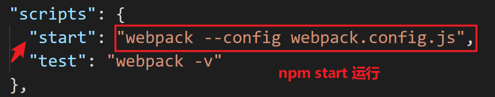

# 学习建议

有选择的敲代码，特别建议出了 bug 自己解决或者问了老师解决了的，可以推倒然后重来，这样有助于记忆

掌握，不一定说能够非常熟练运用，最起码，要跟上老师的逻辑。


# 回顾初次接触 webpack 打包的过程

1. 需要创建一个项目文件夹

2. 在文件夹里面使用 npm init 创建新项目, 这个命令会自动创建 package.json 文件

3. 安装webpack

   ```bash
   npm install --save-dev webpack webpack-cli
   ```

4. 创建一个需要被测试打包的 js 文件

5. 创建一个 webpack.config.js 进行配置, 其中需要配置两个重点内容

   1. 被打包文件 index.js
   2. 打包后输出的文件 (地址和文件名)

   ```js
   const path = require('path');
   
   module.exports = {
       entry: './index.js',
       output: {
           filename: 'pack.js',
           path: path.resolve(__dirname, 'dist')
       }
   }
   ```

6. 在 package.json 里面的 scripts 部分添加脚本用来打包

   

7. 运行 `npm run start` 即可


## 搭建项目架构(固定的做法,只是给后面的Vue项目做基础准备)

目前为止,我们演示了 webpack 的基本使用

实际的项目中, 不可能所有代码都这么堆在一起的。

其实是为之后的 Vue 项目搭建架构做准备。

### 准备项目文件结构

准备项目文件结构如下：

> **注意：** 注释前面带了加号（+）表示手工创建的

```js
- webpack-demo				//最外层, 项目根目录
	- dist					// + 输出目录，在浏览器中运行的目录
	- node_modules			// 安装 npm 包时自动生成
	- src					// + 开发目录 source code
    - package.json			// 项目配置文件, npm init 初始化项目时自动生成
    - webpack.config.js		// + webpack配置文件
```


### 准备文件

`dist/index.html`

```html
<!DOCTYPE html>
<html lang="en">
<head>
    <meta charset="UTF-8">
    <meta name="viewport" content="width=device-width, initial-scale=1.0">
    <meta http-equiv="X-UA-Compatible" content="ie=edge">
    <title>webpack demo</title>
</head>
<body>
    
</body>
</html>
```


`src/index.js`**(打包前的 js 文件)**

```js
// 写入到html的内容
const element = document.createElement("div");
element.innerHTML =  `<div>hello webpack</div>`;

document.body.appendChild(element);
```


### 配置 webpack 

`webpack.config.js`

```js
const path = require('path');

module.exports = {
    entry: './src/index.js',					// 项目入口
    output: {
        filename: 'bundle.js',                  // 默认打包后的文件名 bundle.js
        path: path.resolve(__dirname, 'dist')   // 默认打包后的文件目录 dist
    }
};
```


准备使用打包后的 js 文件

`dist/index.html`

> **注意：**引用的资源都来自于打包后的 dist。

```html
<!DOCTYPE html>
<html lang="en">
<head>
    <meta charset="UTF-8">
    <meta name="viewport" content="width=device-width, initial-scale=1.0">
    <meta http-equiv="X-UA-Compatible" content="ie=edge">
    <title>webpack demo</title>
</head>
<body>
    <script src="./bundle.js"></script>
</body>
</html>
```


### 开始打包

添加 `package.json` 脚本配置

```js
"scripts": {
    "start": "webpack --config webpack.config.js",
    "test": "webpack -v"
}
```


在命令行中输入以下命令：

> 注意切换到项目目录下

```
npm run start
```


输出结果：

```
> webpack-demo@1.0.0 start d:\itheima\course\VueBase\day5\02-源代码-Code\webpack-demo
> webpack --config webpack.config.js

Hash: adc6b8e1d8839a2e9655
Version: webpack 4.41.2
Time: 693ms
Built at: 2019-10-22 3:18:55 PM
    Asset      Size  Chunks             Chunk Names
bundle.js  1.01 KiB       0  [emitted]  main
Entrypoint main = bundle.js
[0] ./src/index.js 159 bytes {0} [built]

WARNING in configuration
The 'mode' option has not been set, webpack will fallback to 'production' for this value. Set 'mode' option to 'development' or 'production' to enable defaults for each environment.
You ca
```


> **注意：**上述输入即是打包成功，配置的警告不影响打包结果，可忽略。


dist 目录结构:

```js
- webpack-demo
	- dist					// 输出目录，在浏览器中运行的目录
		- index.html		// 浏览器页面入口文件
		- bundle.js			// + 打包后的文件
	- // 其他文件

```

### 小结

上面是一个基本的构建过程，除了构建 js 文件外，

还可以对图片，样式，字体文件等资源进行管理`切记这是一个nodejs环境的项目`。


# webpack 四个概念


## 概念一: 入口 (entry)

**入口**指示 webpack 应该使用哪个文件来作为打包的**开始**。拿到这个文件以后，webpack 会找出所有跟这个入口文件有关系的文件, 全部打包起来

> import / require 等导入方式, 都是依赖关系的一种, webpack 会把所有关联的文件全部遍历出来。

一个 `entry` 配置的最简单例子：

**webpack.config.js**

```js
module.exports = {
  entry: './src/index.js'
};
```

## 概念二: 模块加载器 (loader)

模块加载器是webpack用于加载并处理其他 **非js文件** 的外部功能库，

比如以后自定义模板文件(Vue)，css/less，图片，字体等资源文件。

因为 webpack 自己的开发团队有限，很多功能来不及实现, 也不一定有足够的对应技术实力。

有了模块加载器，就可以把处理各种文件的操作，交给别的开发者维护。

例子就是 Vue：

对于 Vue 的文件处理, 作者本身肯定认识比 webpack 开发者深。

所以 webpack 实现核心打包功能, 把独特文件的 loader 加载器交给其他开发者是一个很好的策略。

这是 webpack 成功一个非常重要的因素。


> 注意：
>
> nodejs环境下默认只认识js文件。
>
> 对于其他文件, 本来 node 是不认识的
>
> 所以需要借助别的工具来进行处理


#### 加载 css

新增css文件

```js
- webpack-demo
	- src
    	- index.js			
		- style.css	// + 新增css文件
    - // 其他文件

```


`src/style.css`

```css
.red {
    color: red;
}
```

`src/index.js`

```js
import './style.css';

// 写入到html的内容
var element = document.createElement("div");
element.innerHTML =  `<div class="red">hello webpack</div>`;
document.body.appendChild(element);

```


**webpack 如何加载 css 文件?**

安装两个加载器`style-loader`和`css-loader`，需要下载依赖包

```
npm install --save-dev style-loader css-loader
```


配置 webpack , 让它懂得处理 css 文件

`webpack.config.js`

```js
const path = require('path');

module.exports = {
    entry: './src/index.js',
    output: {
      filename: 'bundle.js',                            
      path: path.resolve(__dirname, 'dist')    
    },
	
    // 模块加载器配置项
    module: {
        rules: [
            {
                test: /\.css$/,			// 匹配css扩展名文件
                use:[					// 配置loader加载器
                    'style-loader',		// 把css代码写入到网页中
                    'css-loader'		// 读取css的代码
                ]	
            }
        ]
    }
};

```


再次执行打包

```
npm run start
```


> 再次打开`dist/index.html`就能看能到红色的文字了。


#### 加载less

新增less文件

```js
- webpack-demo
	- src
    	- index.js			
		- style.css	
		- style.less // + 新增less文件
    - // 其他文件

```


`src/style.less`

```less
body {
    div {
        background: yellow;
    }
}

```


`src/index.js`

```js
import './style.css';
import './style.less';

// 写入到html的内容
var element = document.createElement("div");
element.innerHTML = `<div class="red">hello webpack</div>`;

document.body.appendChild(element);

```


**webpack 如何加载 less 文件?**

安装依赖包

```
npm install --save-dev less less-loader
```


配置 webpack 让它懂得如何处理 less 文件

`webpack.config.js`

```js
const path = require('path');

module.exports = {
    // 其他配置...
	
    // 模块加载器配置项
    module: {
        rules: [
            // 这里上面有其他配置, 比如 css 之类...
            // 添加一个新的, 负责 less 文件
            {
                test: /\.less$/,		// 匹配less扩展名文件
                use:[				
                    'style-loader',		// 把less代码写入到网页中
                    'css-loader',		// 读取less的代码
                    'less-loader'		// 解释编译less代码
                ]	
            },
        ]
    }
};

```


执行打包

```
npm run start
```


#### 加载图片

在 nodejs 环境中所有的文件都是一个模块，需要导入才能使用，图片也不例外，比如我们想要在项目中引入一张图片。

```js
- webpack-demo
	- images
		- logo.jpg
	- // 其他文件

```


`src/index.js`

```js
import './style.css';
import './style.less';

import logo from './images/logo.png';

// 写入到html的内容
// 添加显示图片
var element = document.createElement("div");
element.innerHTML = `
    <div class="red">hello webpack</div>
    
`;

document.body.appendChild(element);
```


> **注意：**能被 src 调用说明`import 的 logo是一个链接, 这是由 webpack 自动生成的`。


**安装依赖包**

```
npm install --save-dev file-loader
```

配置 webpack

`webpack.config.js`

```js
// 其他代码

module.exports = {
    // 其他配置...
	
    // 模块加载器配置项
    module: {
        rules: [
            // 其他配置...
			{
                test: /\.(png|svg|jpg|gif)$/,	// 匹配图片文件
                use: [
                    {
                        loader: "file-loader",              // 处理图片文件返回链接
                        options: {
                            publicPath: "./images/",   		// 引入图片时会在路径前面加上该选项
                            outputPath: "images"            //  输出到dist下的images目录
                        }
                    } 
                ]
            }
        ]
    }
};

```


> **注意：**处理图片时的配置稍微复杂点了，主要是`file-loader`需要搭配一些选项来使用，这些选项可以自行修改，[参考文档。](https://www.webpackjs.com/loaders/file-loader/)


执行打包命令

```
npm run start
```


最新`dist`目录结构

```js
- webpack-demo
	- dist
		- images
			- [hash字符串组成].jpg
		- bundle.js
		- // 其他文件

```


## 概念三: 插件

loader 加载器可以教会 webpack 处理不同文件，

而插件则可以添加其他功能，比如优化压缩，自动生成 html 文件等等

### 提取css

通过`dist`文件结构我们发现打包出的文件中并没有独立的css文件，那么css样式被打包到哪里去了呢？

如果用编辑器打开bundle.js文件会发现内容有`document.createElement("style")`字样，其实css被打包到bundle.js中了。

那么假如 css 的内容很多，`会让 bundle.js 文件变得很大，加载变慢，性能和体验都很差`，所以我们需要把 css 的内容单独拆分到一个样式文件中，使用 [webpack插件ExtractTextWebpackPlugin](https://www.webpackjs.com/plugins/extract-text-webpack-plugin/)


安装依赖包

```
npm install extract-text-webpack-plugin@next --save-dev
```

配置 webpack

跟加载器不一样

- 加载器只需要 配置 module rules 即可
- 插件需要两步 第一引入 (require形式)
- 配置 在一个叫做 plugins 的属性里面


`webpack.config.js`

```js
const path = require('path');
//  导入提取样式的webpack插件
const ExtractTextPlugin = require("extract-text-webpack-plugin");
module.exports = {
    entry: './src/index.js',					// 项目入口
    output: {
        filename: 'bundle.js',                  // 默认打包后的文件名 bundle.js
        path: path.resolve(__dirname, 'dist')   // 默认打包后的文件目录 dist
    },

    // 模块加载器配置项
    module: {
        rules: [
            // {
            //     test: /\.css$/,			// 匹配css扩展名文件
            //     use: [					// 配置loader加载器
            //         'style-loader',		// 把css代码写入到网页中
            //         'css-loader'		// 读取css的代码
            //     ]
            // },
            // {
            //     test: /\.less$/,		// 匹配less扩展名文件
            //     use: [
            //         'style-loader',		// 把less代码写入到网页中
            //         'css-loader',		// 读取less的代码
            //         'less-loader'		// 解释编译less代码
            //     ]
            // },
            {
                test: /\.css$/,
                use: ExtractTextPlugin.extract({	// 提取css
                    fallback: "style-loader",
                    use: ["css-loader"]
                })
            },
            {
                test: /\.less$/,
                use: ExtractTextPlugin.extract({	// 提取less
                    fallback: "style-loader",
                    use: ["css-loader", "less-loader"]
                })
            },
        ]
    },
    // 使用插件配置
    plugins: [
        new ExtractTextPlugin('style/style.css') // 提取到dist的style文件夹中
    ]
};

```


执行打包

```
npm run start
```


最新`dist`目录结构

```js
- webpack-demo
	- dist
		- style
			- style.css // 打包后的css文件
		- // 其他文件

```

单单打包完了还不够, 现在所有css 都被提取出来, 原来的样式没有了

需要把打包后的样式导入的`index.html`中

`dist/index.html`

```html
<!DOCTYPE html>
<html lang="en">
<head>
    <meta charset="UTF-8">
    <meta name="viewport" content="width=device-width, initial-scale=1.0">
    <meta http-equiv="X-UA-Compatible" content="ie=edge">
    <title>webpack demo</title>
    <!-- + 导入样式 -->
    <link rel="stylesheet" href="./style/style.css">
</head>
<body>
    <script src="./bundle.js"></script>
</body>
</html>

```


### 自动生成html

目前我们都是在 index.html 中手动引入打包后的资源，这种引入方式有很多缺点，比如文件名依赖问题，`假如 webpack 配置中的输出文件名修改了，需要及时在 index.html 中同步修改，`再者每次新增文件都要引入一遍很繁琐。

可以使用 [HtmlWebpackPlugin插件](https://www.webpackjs.com/guides/output-management/#%E8%AE%BE%E5%AE%9A-htmlwebpackplugin) 自动引入打包后的资源文件到html文件，该插件需要指定一个html模板文件，并且会生成一个 index.html 文件到 dist 目录中。

既然都要自动生成了，那么 dist 下 index.html 就没必要存在了，删除 `dist/index.html`，并且新建html模板文件.


**新增 public 目录存放公共资源：**

```js
- webpack-demo
	- // 其他文件
    - public
		- index.html

```


`public/index.html`

```html
<!DOCTYPE html>
<html lang="en">
<head>
    <meta charset="UTF-8">
    <meta name="viewport" content="width=device-width, initial-scale=1.0">
    <meta http-equiv="X-UA-Compatible" content="ie=edge">
    <title>webpack demo</title>
</head>
<body>
</body>
</html>

```


安装依赖包

```
npm install --save-dev html-webpack-plugin
```


`webpack.config.js`

```js
// 其他引入
const HtmlWebpackPlugin = require("html-webpack-plugin");

module.exports = {
   	// 其他配置
    
    plugins: [
        new ExtractTextPlugin("style/style.css"),
        // + 新增配置
        new HtmlWebpackPlugin({
            template: "public/index.html"	// template指定默认html模板
        })
    ]
};

```


执行打包

```
npm run start
```


此时`dist/index.html`被自动生成, 

打开`dist/index.html`会发现已经自动引入了资源了。


### 打包前清理旧dist文件夹

使用 [clean-webpack-plugin插件](https://www.webpackjs.com/guides/output-management/#%E6%B8%85%E7%90%86-dist-%E6%96%87%E4%BB%B6%E5%A4%B9) 在每次打包前清除下dist文件夹的内容。

webpack 官方对于这个插件的文档有坑 如果需要可以看作者自己的文档

或者直接按照这里的实例来写即可

作者的文档:

 https://github.com/johnagan/clean-webpack-plugin#options-and-defaults-optional 

安装依赖包

```
npm install --save-dev clean-webpack-plugin 
```


`webpack.config.js`

```js
// 其他代码

// 导入清除插件
const { CleanWebpackPlugin } = require('clean-webpack-plugin');

module.exports = {
    // 其他配置

    plugins: [
        new ExtractTextPlugin("style/style.css"),
		
        // 调用清除打包目录插件
        new CleanWebpackPlugin(),
        
        new HtmlWebpackPlugin({
            template: "public/index.html"
        }),
        
    ]
};


```


## 概念四: 输出

**output** 属性告诉 webpack 在哪里输出它所创建的 *bundles* 打包文件，以及如何命名这些文件，一般约定输出目录为 `./dist`。

基本上，整个应用程序结构，都会被编译到你指定的输出路径的文件夹中。

你可以通过在配置中指定一个 `output` 字段，来配置这些处理过程：

**webpack.config.js**

```javascript
const path = require('path');

module.exports = {
  entry: './index.js',
  output: {
    path: path.resolve(__dirname, 'dist'),
    filename: '想要的文件名.js' // 通常是 bundle.js
  }
};
```

# 日常工作优化

## 开发环境

开发环境一般指的是我们在`本地开发`时候使用的场景，这种场景下代码可以快速追踪错误，不压缩文件，而且由于在本地开发，所以可以加载体积大一点文件。


### 错误追踪

我们先来做一个错误追踪的测试，新建一个`error.js`。

这个不是必须的, 我这里只是模拟我们不小心写了错误代码

`src/error.js`

```js
const error = function() {
    var a = b;
}
module.exports = error;
```

> **注意：** 
>
> - 上面的代码打包不会报错
> - 浏览器运行会报错，b 没有定义。

`src/index.js`

```js
import './style.css';
import './style.less';

import logo from './images/logo.png';

// + 导入错误的模块
const error = require("./error");
// 执行报错的函数
error()

// 写入到html的内容
const element = document.createElement("div");
element.innerHTML = `
    <div class="red">hello webpack</div>
    <div class="blue">hello webpack</div>
    
    `;

document.body.appendChild(element);
```


执行打包命令

```
npm run start
```


刷新`dist/index.html`，可以看到以下的错误信息。

```
bundle.js:1 Uncaught ReferenceError: b is not defined
    at e.exports (bundle.js:1)
    at Object.<anonymous> (bundle.js:1)
    at t (bundle.js:1)
    at bundle.js:1
    at bundle.js:1
```


上面我们写了一个错误的函数，但是浏览器的在报错的时候提示的`错误文件是bundle.js`，这当然是正常的，因为这是我们最后打包出来的文件，但是我们可以通过[webpack的source map](https://www.webpackjs.com/guides/development/#使用-source-map)准确地知道错误来自于哪个源文件。


`webpack.config.js`

添加开发工具的配置

```js
// 其他代码

module.exports = {
    // 其他配置

    devtool: "source-map", // + 生成映射源代码文件

    // 模块加载器配置项
    module: {
        // 其他代码
    },
    
    // 其他配置 

```


> **注意：** 上面的 [devtool:"source-map" 配置](https://www.webpackjs.com/configuration/devtool/#devtool)会在`dist`目录中生成一个`bundle.js.map`文件，该文件主要的作用是把打包后的`bundle.js`映射到源文件上，这样就可以准确的追踪报错的源代码的位置了。
>
> `bundle.js.map`文件也会加载到页面中，并且文件体积很大，所以此模式只适用于开发环境。


再次执行打包命名，查看错误提示

```
error.js:2 Uncaught ReferenceError: b is not defined
    at e.exports (error.js:2)
    at Object.<anonymous> (index.js:7)
    at t (bootstrap:19)
    at bootstrap:83
    at bundle.js:1

```

此时错误就很精确了，`error.js` 第3行。


### 开发服务器

目前我们修改一次代码，就要执行一遍 `npm run start` 打包，非常麻烦，webpack 提供了一个简单的开发服务器 `webpack-dev-server`，该服务器能够帮助我们在本地开启一个开发服务器环境，并且能够**监听文件的修改**，每当编辑文件保存后浏览器会自动加载刷新页面。


安装依赖

```
npm install --save-dev webpack-dev-server
```


`webpack.config.js`

```js
// 其他代码

module.exports = {
    // 其他配置
    
    devtool: "source-map", 
	
    // + 开发服务配置
    devServer: {
         port: 8080 // 默认端口是8080
    },

    // 模块加载器配置项
    module: {
        // 其他配置
    }
    
    // 其他配置
}

```


> **注意：**可以通过文档查看 [devServer 服务器配置列表](https://www.webpackjs.com/configuration/dev-server/)


上面的配置devServer可以对开发服务器进行配置。

**注意：devServer不读取项目中的dist目录，而是读取服务器内存中的文件，我们不需要知道具体的存放地址，只需要知道两者输出的内容是一样的。**

如何验证？可以删除项目下的 dist 文件夹进行验证。

下面来添加一个新的`scripts`命令，用于启动开发服务器。

`package.json`

```json
{
    // 其他配置
    
	"scripts": {
    	"start": "webpack --config webpack.config.js",
    	"dev": "webpack-dev-server --config webpack.config.js --open"
  	},
    
    // 其他配置
}

```

> **注意：** webpack-dev-server添加了两个配置选项：
>
> 1. `--config webpack.config.js` 和 webpack 一样是默认配置文件，可以省略。
> 2. `--open` 表示自动打开浏览器，该配置默认值是`false`。


打开开发服务器命令 不再是 start 命令 而是 dev(自己起名字, 通常叫 dev development)

```
npm run dev
```

> **注意：**启动后不要关闭命令行窗口，否则会关闭服务器，可以使用`ctrl+c`关闭服务器。


打开浏览器访问地址<http://localhost:8080/>，然后尝试修改`src`中任何一个文件保存，浏览器就自动刷新了。


## 开发环境 / 生产环境配置分离

分离提供给开发者的打包配置和提供给真正用户的打包配置

生产环境和开发环境刚好相反，开发环境在本地运行，而生产环境是要产出`运行在线上服务器面向用户使用的代码`，因此两者的构建目标差异很大，比如打包后的文件在生产环境中要尽可能的小，逻辑代码分离，优化静态资源（压缩图片），去除 `source map`文件等。


**因此开发环境和生产环境不能共用一份webpack配置文件，需要分别指定**

但是两个环境还是有很多配置可以共用的，比如entry、output、module等，因此可以把公共部分的配置抽离出来放到一个独立的文件然后进行合并，我们可以使用`webpack-merge`工具来进行合并。

merge 意思是合并

> **注意：**entry、output、module这些配置在我们当前示例可以通用，但未必适合所有项目。


安装依赖

```
npm install --save-dev webpack-merge
```


开始拆分`webpack.config.js`文件，拆分后该文件可废弃。

新建`config`文件夹:

```js
- webpack-demo
	- config 				// 存放配置文件的文件夹
		- webpack.base.js	// 公共的配置
		- webpack.dev.js	// 开发环境的配置
		- webpack.prod.js	// 生成环境的配置

	- // 其他文件

```


### 配置文件

`config/webpack.base.js`

```js
const path = require("path");
const ExtractTextPlugin = require("extract-text-webpack-plugin");
const HtmlWebpackPlugin = require("html-webpack-plugin");
const { CleanWebpackPlugin } = require('clean-webpack-plugin');

module.exports = {
    // 入口
    entry: "./src/index.js",
    
    // 输出
    output: {
        filename: "bundle.js",
        path: path.resolve(__dirname, "../dist")  // 注意此处输出目录是父级文件夹
    },
    
    // 模块加载器
    module: {
        rules: [
            {
                test: /\.css$/,
                use: ExtractTextPlugin.extract({
                    fallback: "style-loader",
                    use: ["css-loader"]
                })
            },
            {
                test: /\.less$/,
                use: ExtractTextPlugin.extract({
                    fallback: "style-loader",
                    use: ["css-loader", "less-loader"]
                })
            },
            {
                test: /\.(png|svg|jpg|gif)$/,
                use: [
                    {
                        loader: "file-loader", 
                        options: {
                            publicPath: "./images/", 
                            outputPath: "images"
                        }
                    }
                ]
            }
        ]
    },

    plugins: [
        // 提取css样式到单独文件
        new ExtractTextPlugin("style/style2.css"),
		
        // 每次构建前清除dist目录
        new CleanWebpackPlugin(),
		
        // 自动生成index.html到dist
        new HtmlWebpackPlugin({
            template: "public/index.html"
        }),
    ]
}

```


`webpack.dev.js`

```js
const merge = require('webpack-merge');
const base = require('./webpack.base.js');

module.exports = merge(base, {
    mode: "development",
    
    // 生成map映射文件
    devtool: "source-map",
	
    // 开发服务器配置
    devServer: {
        port: 8000 // 默认端口是8080
   },
})

```


`webpack.pro.js`

```js
const merge = require('webpack-merge');
const base = require('./webpack.base.js');

module.exports = merge(base, {
    mode: "production"
})

```


> **注意：**拆分完 `webpack.config.js` 后可以把该文件删除了。


修改`scripts`启动命令，**删除 start 命令，增加 build 命令用于生产环境，注意指定配置文件的路径变化**

`package.json`

```json
{
    // 其他配置
    
    "scripts": {
      "dev": "webpack-dev-server --config webpack.config.js --open",
      "build": "webpack --config ./config/webpack.pro.js"
    },
    
    // 其他配置
}

```


OK！以后开发的话就使用`npm run dev`命令，需要打包上线就运行`npm run build`，把dist目录丢给运维的同事部署即可。


